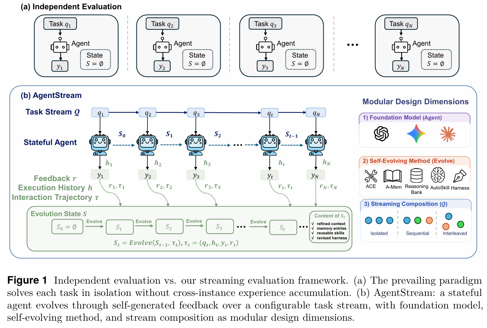

<div align="center">

<h1>AgentStream: How Well Do Self-Evolving LLM Agents Perform Under Streaming Tasks?</h1>

<p>
  Dong Yan<sup>1,2,3</sup>,
  Jian Liang<sup>1,3†</sup>,
  Dapeng Hu<sup>2†</sup>,
  Ran He<sup>1,3</sup>,
  Nicholas Jing Yuan<sup>2</sup>,
  Qi Zhang<sup>2</sup>,
  Tieniu Tan<sup>1,3,4</sup>
</p>

<p>
  <sup>1</sup>School of Artificial Intelligence, University of Chinese Academy of Sciences<br>
  <sup>2</sup>Microsoft<br>
  <sup>3</sup>Institute of Automation, Chinese Academy of Sciences<br>
  <sup>4</sup>Nanjing University
</p>

<p>
  📧 <code>liangjian92@gmail.com</code> &nbsp;
  <code>dapenghu@microsoft.com</code>
</p>

<p>
  <a href="https://arxiv.org/abs/2608.00155"></a>
</p>

</div>

## 🚀 News
* **[2026/08]** Code is released!
* **[2026/07]** Code is under preparation. Stay tuned!

## 📖 Overview
Large language model (LLM) agents can self-evolve by continually improving from their own accumulated experience.
However, existing studies predominantly adopt independent evaluation.
Consequently, the behavior of self-evolving agents in realistic streaming settings, where agents adapt to diverse and complex task streams, remains poorly understood.
To address this gap, we introduce AgentStream, a unified framework that evaluates self-evolving agents spanning diverse evolution components by organizing agentic benchmarks into a configurable task stream and instantiating the `Isolated`, `Sequential`, and `Interleaved` streaming scenarios at test time, which progressively vary the scope and domain composition of the stream.
Over these scenarios, we combinatorially evaluate five representative self-evolving methods across three frontier foundation models, disentangling how model capability, method architecture, and streaming scenario jointly shape self-evolution.
Our results show that self-evolution reliability varies across streaming scenarios, the benefit of self-evolution is gated by model capability and non-monotonic in model strength, and no single method dominates across models and scenarios.
These findings offer concrete guidance for selecting self-evolving methods across models and streaming scenarios.
Overall, we advocate that self-evolving agents should be evaluated under realistic task streams rather than isolated single-task settings.

<div align="center">
  
</div>

## ⚡️ Getting Started

AgentStream is built on the [`Exgentic`](./exgentic) framework, which is bundled in this repository. The five self-evolving agents live under [`exgentic/src/exgentic/agents`](./exgentic/src/exgentic/agents), and the benchmarks are orchestrated through `exgentic`'s installation and runner infrastructure.

### 1. Requirements

- Python `>= 3.11`
- [`uv`](https://github.com/astral-sh/uv)
- Docker (optional)

### 2. Install the local exgentic (agent side)

Clone the repo and create an editable environment from the bundled `exgentic`:

```bash
git clone https://github.com/Jasper-Yan/AgentStream.git
cd AgentStream/exgentic

# Install the local ./src/exgentic in editable mode into .venv/
uv sync

# Activate the environment
source .venv/bin/activate
```

Verify that the self-evolving agents are visible from the local install:

```bash
uv run exgentic list agents
```

### 3. Install benchmarks (benchmark side)

Each benchmark is installed into isolated **`venv`** environment:

```bash
cd AgentStream/exgentic


uv run exgentic install --benchmark tau2
uv run exgentic install --benchmark bfcl
uv run exgentic install --benchmark hle
uv run exgentic install --benchmark appworld
uv run exgentic install --benchmark swebench
uv run exgentic install --benchmark browsecompplus
```

### 4. API credentials

The runners call LLMs through [LiteLLM](https://docs.litellm.ai/). Set the credentials for your provider in the [`exgentic/scripts/<method>/run_experiment.sh`](./exgentic/scripts/ace/run_experiment.sh):

```bash
export OPENAI_API_KEY="..."
export OPENAI_API_BASE="..."
```

### 5. Run the streaming experiments

Each method has its own runner under [`exgentic/scripts/<method>`](./exgentic/scripts). The shell script selects the streaming scenario via `MODE` (`isolated` | `sequential` | `interleaved`), the model, the seed, and the benchmark stream:

```bash
cd AgentStream/exgentic/scripts/ace

bash run_experiment.sh
```


## 🙏 Acknowledgement
This work is based on [Exgentic](https://github.com/Exgentic/exgentic). We sincerely thank the authors and contributors of these excellent open-source projects.

## 📚 Citation
If you find our work helpful, please consider citing:

```bibtex
@article{yan2026agentstream,
  title={AgentStream: How Well Do Self-Evolving LLM Agents Perform Under Streaming Tasks?},
  author={Yan, Dong and Liang, Jian and Hu, Dapeng and He, Ran and Yuan, Nicholas Jing and Zhang, Qi and Tan, Tieniu},
  journal={arXiv preprint arXiv:2608.00155},
  year={2026}
}
```

## 📄 License

This project is licensed under the Apache License 2.0.
