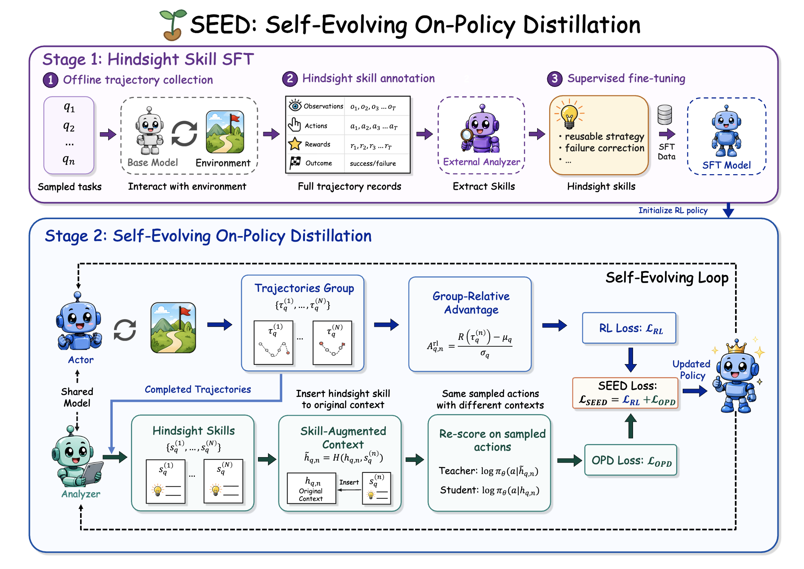

<h1 align="center">

SEED: Self-Evolving On-Policy Distillation for Agentic Reinforcement Learning
</h1>

<p align="center">
  <a href="https://jinyangwu.github.io/seed/">
    
  </a>
  <a href="https://huggingface.co/papers/2607.14777">
    
  </a>
  <a href="https://arxiv.org/abs/2607.14777">
    
  </a>
  <a href="https://huggingface.co/Jinyang23/Seed-AlfWorld-3B">
    
  </a>
</p>

## News

- **2026-07-16**: We have released our paper and code.

If you have any questions ❓ or are interested in collaboration 🤝, please feel free to contact me at 
wu-jy23@mails.tsinghua.edu.cn.

## Overview

**SEED** is a **Self-Evolving On-Policy Distillation** framework for long-horizon
LLM agents. Its core idea is to make one policy checkpoint play two synchronized
roles: it acts in the environment to collect on-policy trajectories, then analyzes
its own completed trajectories into hindsight skills, and finally distills the
skill-induced change in action probabilities back into the ordinary policy. After
each update, the improved policy becomes the next analyzer and generates the next
round of hindsight skills, so the decision policy and hindsight supervision
evolve together.

SEED has two stages:

1. **Hindsight-skill SFT.** Collect ordinary agent trajectories, annotate each
   completed trajectory with an episode-level hindsight skill, and fine-tune the
   backbone so the same model can analyze trajectories.
2. **Self-evolving OPD during RL.** At each RL update, the frozen current policy
   both samples on-policy trajectories and serves as the synchronized analyzer
   that extracts hindsight skills. The same sampled action tokens are re-scored
   under ordinary and skill-augmented contexts. The skill-induced log-probability
   shift gates a dense OPD loss, which is optimized jointly with GRPO.

At inference time, SEED uses only the learned policy. It requires no analyzer,
no skill bank, no retrieval module, and no skill-augmented prompt at deployment.

<div align="center">
  
  <br>
  <em>Figure 1: Overview of SEED.</em>
</div>

## Main Results

Across ALFWorld, Search-based QA, and WebShop, the experiments show three main
findings:

1. **Dense hindsight supervision improves outcome-only RL.** SEED consistently
   outperforms GRPO by converting trajectory-level hindsight into token-level
   OPD signals.
2. **Internalizing skills is better than prompting with skills.** SEED uses
   hindsight skills only during training and still outperforms skill-prompted
   evaluation baselines.
3. **Self-evolving distillation beats static distillation.** Refreshing the
   analyzer from the latest policy keeps hindsight supervision aligned with the
   policy's evolving behaviors and failure modes.

<div align="center">
  
  <br>
  <em>Figure 2: Main results.</em>
</div>

## Installation

### Install veRL

```bash
conda create -n seed python==3.12 -y
conda activate seed

pip3 install vllm==0.11.0
pip3 install flash-attn==2.7.4.post1 --no-build-isolation --no-cache-dir
pip install -e .
```

### Install Supported Environments

#### 1. ALFWorld

```bash
pip3 install gymnasium==0.29.1
pip3 install stable-baselines3==2.6.0
pip3 install alfworld
```
Download PDDL & Game files and pre-trained MaskRCNN detector (will be stored in ~/.cache/alfworld/):
```bash
alfworld-download -f
```
#### 2. WebShop

WebShop requires Python <= 3.10, so begin by creating a separate environment:

```bash
conda create -n seed-webshop python==3.10 -y
conda activate seed-webshop

cd ./agent_system/environments/env_package/webshop/webshop
./setup.sh -d all

cd repo_root/
pip3 install torch==2.6.0 --index-url https://download.pytorch.org/whl/cu124
pip3 install flash-attn==2.7.4.post1 --no-build-isolation
pip3 install -e .
pip3 install vllm==0.8.2
```


#### 3. Search-Based QA

```bash
cd ./agent_system/environments/env_package/search/third_party
pip install -e .
pip install gym==0.26.2
```

Prepare the Search-R1 style dataset:

```bash
cd repo_root/
python examples/data_preprocess/preprocess_search_r1_dataset.py
```

The processed data is saved under `~/data/searchR1_processed_direct` by default.

Build a separate retrieval environment for the local search server:

```bash
conda create -n retriever python=3.10 -y
conda activate retriever

conda install numpy==1.26.4
pip install torch==2.6.0 torchvision==0.21.0 torchaudio==2.6.0 --index-url https://download.pytorch.org/whl/cu124
pip install transformers datasets pyserini huggingface_hub
conda install faiss-gpu==1.8.0 -c pytorch -c nvidia -y
pip install uvicorn fastapi
```

Download the index:

```bash
conda activate retriever

local_dir=~/data/searchR1
python examples/search/searchr1_download.py --local_dir $local_dir
cat $local_dir/part_* > $local_dir/e5_Flat.index
gzip -d $local_dir/wiki-18.jsonl.gz
```

Start the local flat e5 retrieval server:

```bash
conda activate retriever

bash examples/search/retriever/retrieval_launch.sh > retrieval_server.log
```

## Training

The training and data-construction scripts load environment variables from the
repo-level `.env` file by default. Put model paths, analyzer endpoints, and
optional logging keys there before running the scripts:

```bash
# Runtime devices and logging.
CUDA_VISIBLE_DEVICES=0,1,2,3,4,5,6,7
WANDB_MODE=offline

# Local model and data roots.
MODELS_ROOT=/path/to/models # the parent dir of models
DATA_ROOT=/path/to/data-root # used for search-qa data

# Used by Stage 1 hindsight-skill annotation.
OPENAI_API_KEY=your_key_here
OPENAI_BASE_URL=https://your-openai-compatible-endpoint/v1
OPENAI_MODEL=glm-5.2
OPENAI_API_RETRIES=5
OPENAI_API_RETRY_DELAY=1.0
```


### Stage 1: Build Hindsight-Skill SFT Checkpoints

The paper-style workflow first builds episode-level skill SFT data and trains an
analyzer-capable policy checkpoint.

```bash
# ALFWorld
bash scripts/sft/alfworld/prepare_data.sh
bash scripts/sft/alfworld/train_sft.sh

# WebShop
bash scripts/sft/webshop/prepare_data.sh
bash scripts/sft/webshop/train_sft.sh

# Search-based QA
bash scripts/sft/search/prepare_data.sh
bash scripts/sft/search/train_sft.sh

# EZPoints
bash scripts/sft/ezpoints/prepare_data.sh
bash scripts/sft/ezpoints/train_sft.sh

# Sokoban
bash scripts/sft/sokoban/prepare_data.sh
bash scripts/sft/sokoban/train_sft.sh
```

The default scale follows the paper: 180 tasks and 8 rollouts per task. The SFT
scripts train for 3 epochs and export Hugging Face checkpoints under
`$MODELS_ROOT`. All five datasets use the same
`prepare_data.sh` / `train_sft.sh` interface; see
[`scripts/sft/README.md`](scripts/sft/README.md) for defaults and overrides.

### Stage 2: Run Self-Evolving OPD RL

All SEED RL scripts live under `examples/seed_trainer/` and assume the repo root
as the working directory.

```bash
bash examples/seed_trainer/run_alfworld_sft_glm_self.sh
bash examples/seed_trainer/run_webshop_sft_glm_self.sh
bash examples/seed_trainer/run_search_sft_glm_self.sh
```

Other teacher-self SFT entrypoints use the same naming convention:

```bash
bash examples/seed_trainer/run_alfworld_sft_qwen_self.sh
bash examples/seed_trainer/run_ezpoints_sft_gemini_self.sh
bash examples/seed_trainer/run_sokoban_sft_gemini_self.sh
```


## 可选改进开关（AgentStream / global pool，默认全部关闭）

九个开关都在 `examples/agentstream_trainer/agentstream_full.env`（§4 末尾），经
`run_agentstream_sft_glm_self.sh` → `_common/agentstream.sh` → hydra 传入；关闭时训练逻辑与
原始实现逐 bit 一致（`run_agentstream_baseline.sh` 另把它们显式钉在默认值上）。共同背景：OPD 损失
`loss = gate·(teacher_lp − student_lp)`，`gate = sigmoid(β·(teacher_lp − student_lp))`，其梯度对每个
token 都是 `−gate`，只会推高学生已采样的 token，从不推低。前三个开关分别处理由此产生的三个问题，
[4][5] 处理 2026-09-19 wandb 实测出的两个问题：teacher 只比学生多看一句自写的 hindsight skill 时
gap 平均为负，以及失败轨迹上 PG 与 OPD 方向相反。[6]-[8] 是 "GRPO 下限" 守卫（`seed/gating.py`）：
v5 单遍流上 SEED 落后 GRPO 的差距几乎全在 browsecomp，机制是 OPD 退化为对自己 rollout 的模仿锚；
三个开关分别在方向、力度、信息三处让无信息的 teacher 不再产生更新，SEED 的下限回到 GRPO。

| 开关（env 变量 → hydra 键） | 默认 | 开启后的行为 |
|---|---|---|
| `AGENTSTREAM_SEED_FAILED_SKILL_POSITIVE` → `algorithm.seed.failed_skill_positive` | False | 失败轨迹的 episode_skill 从 avoidance 规则改为"本应遵循的规则"（正向 workflow），spec 与 gen 两通道同时可用；global pool 准入对失败候选不再做 spec_gap 门控，固定排在所有成功候选之后，judge 是唯一过滤器，per-step 上限先截失败候选。池侧效果依赖 `AGENTSTREAM_SEED_GLOBAL_POOL_ADMIT_FAILED=True`（full env 默认 True，`agentstream.sh` 单独默认 False）：为 False 时失败候选在收集阶段即被丢弃，开关只改 prompt，启动时会打 warning |
| `AGENTSTREAM_SEED_GLOBAL_POOL_EVICT_POLICY` → `algorithm.seed.global_pool.evict_policy`（配 `..._WINDOW_STEPS` → `window_steps`） | gate_ema / 48 | 满员淘汰策略。`gate_ema`（原始）按 gate EMA 最低淘汰；`lru` 淘汰最久未被检索者；`window` 每步删除入池早于 `当前步 − window_steps` 的条目（检索不续命），满员时按入池步 FIFO |
| `AGENTSTREAM_SEED_OPD_POSITIVE_ONLY` → `actor_rollout_ref.actor.opd_positive_only` | False | spec 与 gen 两通道只在 `teacher_lp − student_lp > 0` 的 token 上施加损失；token-mean 分母与全部 `actor/opd_*` 指标仍按原 mask 统计，系数语义和曲线口径不变，`opd_loss` 变为非负；可与 `opd_gate_eps` 叠加 |
| `AGENTSTREAM_SEED_LOCAL_TEACHER_SOURCE` → `algorithm.seed.local_teacher_source` | skill | `sibling_success`：不调用分析器；每个任务组里若同时有成功与失败轨迹，取步数最少的成功轨迹，程序化抽成"观测摘录 → 动作 JSON"的骨架，作为 "Reference Solution" 段放进 teacher prompt，只给同组失败轨迹的 token 打分；全败 / 全成组本步无 teacher。骨架上限 `algorithm.seed.sibling_teacher.{obs_chars,action_chars,max_chars}`。要求 `opd_gen_loss_coef=0`、`skill_mode != step_only`；teacher-advantage 模式同样可用 |
| `AGENTSTREAM_SEED_ROUTE_MODE` → `algorithm.seed.route_mode`（配 `..._ROUTE_PG_FAILED_WEIGHT` → `route_pg_failed_weight`） | none / 0.0 | `sample`：每行一个 PG 权重，成功轨迹 1、有成有败组里的失败轨迹 = `route_pg_failed_weight`（0 = 硬路由，这些行只由 OPD teacher 更新）、全败 / 全成组 1；KL / 熵 / OPD 的掩码不变。要求 `loss_agg_mode=token-mean`、`policy_loss.loss_mode=vanilla`；无 OPD / teacher 信号时只是丢弃负样本 |
| `AGENTSTREAM_SEED_SUCCESS_ONLY` → `algorithm.seed.success_only` | False | 只分析、只蒸馏被验证成功的轨迹（无标签轨迹跳过），`failed_only` 的镜像，两者互斥；掩码由"已分析轨迹"推出，OPD 与 teacher-advantage 两条路径自动只覆盖成功轨迹，失败轨迹只剩 GRPO 一个目标。与 `local_teacher_source=sibling_success` 互斥；须与下一项同开 |
| `AGENTSTREAM_SEED_OPD_NORM_MODE` → `actor_rollout_ref.actor.opd_norm_mode` | mask | `response`：spec 与 gen 两通道的 OPD 分子不变，分母从掩码 token 数改为全部 response token 数（与 PG 同分母），系数变成固定的"OPD 每 token 力度 / PG 每 token 力度"，不再随掩码占比放大（mask 模式的隐式放大倍数 = 1/掩码占比，基线里在 0.13–0.75 之间跳动）。`actor/opd_*` 指标口径不变；要求 `loss_agg_mode=token-mean` |
| `AGENTSTREAM_SEED_TRAJ_GAP_GATE` → `algorithm.seed.traj_gap_gate.enable`（配 `..._MARGIN` → `margin`，nats/token） | False / 0.0 | 每条有 teacher 信号的轨迹，把 `teacher_lp − old_lp` 在其信号行的 response token 上取平均，均值 ≤ margin 的轨迹整条移出全部 teacher 掩码（OPD 与 teacher-advantage 都跳过），teacher 对数概率不改。在 teacher 信号汇合后、`compute_advantage` 与 replay 之前执行。与 `ema_mode=teacher/both`、`local_teacher_source=sibling_success` 互斥 |
| `AGENTSTREAM_SEED_SIBLING_RESAMPLE` → `algorithm.seed.sibling_resample.enable`（配 `..._MAX_GROUPS` → `max_groups`；渲染上限 hydra-only） | False / 4 | 正常采样后，最多取 `max_groups` 个有成有败的组，每组最短成功轨迹渲染成 "Reference Solution"（逐步 观测 + 完整回复），对这些题再采一遍（每题仍 `env.rollout.n` 条），参考只进采样 prompt；新行在普通 prompt 下重新分词并入本步 batch，与其他行同样做 reward / old_log_prob / advantage / 更新，自成 GRPO 组。在线指标不计这一遍。需要 `env.rollout.n > 1`，与 `algorithm.filter_groups` 互斥，只支持 AgentStream |
| `AGENTSTREAM_SEED_SIBLING_RESAMPLE_BASELINE` → `algorithm.seed.sibling_resample.baseline` | own | `source`：重采行不再自成 GRPO 组，而用其来源组主遍的均值 / 方差归一化（`gigpo/core_gigpo.py::foreign_baseline_stats`，方差取来源组与全体主遍行的较大者，避免全失败来源组的 σ=0 放大），全成功的重采组也有正 advantage（B 组里 38% 的重采组全成功而无信号）。观测 `seed/resample/{adv_mean, adv_pos_frac}` |
| `AGENTSTREAM_SEED_SIBLING_RESAMPLE_POOL_MAX_GROUPS` → `algorithm.seed.sibling_resample.pool_max_groups` | 0 | > 0（需 `SIBLING_RESAMPLE=True` 且 `GLOBAL_POOL_SOURCE=pool`）：全失败组没有兄弟可参考，改为向全局池检索一条跨任务 skill（排除同题条目，`min_sim` 生效），最多这么多组带着它（"General Skill" 节）再采一遍；该组有无成功记到 skill 上（`record_rescue`，`window` 淘汰按此续命）。池 skill 永不进主遍 prompt，gen OPD 通道可以同时关闭（`OPD_GEN_LOSS_COEF=0`） |
| `AGENTSTREAM_SEED_GLOBAL_POOL_ADMISSION` → `algorithm.seed.global_pool.admission` | gap | `success`：候选不看 spec gap，成功轨迹的 skill 每题一条直接进 judge（`policy_vllm` judge 在分析后就地准入、此时尚无 gap，必须用它） |
| `AGENTSTREAM_SEED_GLOBAL_POOL_JUDGE_BACKEND` → `algorithm.seed.global_pool.judge_backend` | openai | `policy_vllm`：策略自己用 vLLM 引擎在分析后同步给候选打 0–10 分（/10 与 `score_threshold` 比较），不需要 API key，需 `analysis_backend=policy_vllm` 与 `admission=success`；`none`：不评审，全部入池 |
| `AGENTSTREAM_SEED_GLOBAL_POOL_REWRITE` → `algorithm.seed.global_pool.rewrite`（`rewrite_neighbors` / `rewrite_max_tokens` hydra-only，3 / 512） | none | 仅 `policy_vllm` judge：`deinstantiate` 把 skill 改写成去掉名字 / ID / 数值 / 清单、只留决策规则与动作顺序的任务族规则；`aggregate` 与池中最近 `rewrite_neighbors` 条（其他任务）合并成一条通用规则。改写文本入池，原文 id 记在 `source.raw_id` 上防止每步重提（`seed/skill_rewrite.py`） |

为什么需要它们：

- **失败 skill 的正向措辞**。avoidance 措辞的信号落在需要推低的 token 上，单边损失下 gate 归零，
  失败轨迹只剩 gap≈0 的自我模仿；上游 SEED 的 avoidance prompt 只在 teacher-advantage 模式
  （`opd_loss_coef=0`，带符号 gap 直接进 advantage）下语义成立，而上游与本仓库默认都跑 OPD 损失模式。
  正向措辞让失败轨迹里做对的部分获得正 gap；准入随之放行是必要配套，否则正向 skill 在失败轨迹上
  gap 为正会被原有的 `-spec_gap>0` 规则全部丢弃。若启用 skill_gen 且 `failed_reward_mode=negate`，
  与本开关矛盾，需改回 `zero`。
- **淘汰策略**。gate EMA 是一致性量而非有用性量，实际值聚在 0.5 略下，原始策略会先淘汰被检索过的
  活跃条目、保留从未命中的死重。`lru` 直接针对死重；`window` 是近因先验，会清掉跨域旧 skill，
  建议作为命名消融而非默认。
- **正 gap 限定**。gap<0 的 token 仍以 gate∈(0,0.5) 的权重被推高，方向与 teacher 相反，等价于对
  自己 rollout 的半权重 BC（失败轨迹的错误动作也在内）。置零后 `opd_loss` 的下降只剩"正 gap token
  被学会"一种解释，无关的 pool 命中梯度趋近零，使放宽准入没有下行风险。
- **成功兄弟 teacher**。teacher 与学生共享权重，唯一的杠杆是特权上下文的信息量；一句 4B 模型自写的
  hindsight 规则不构成特权信息（实测 gap 为负），而同任务组里已验证成功的兄弟轨迹是免费且真正的
  特权信息（SDPO 同族做法）。只给失败轨迹打分，得到的是 GRPO 给不出的 token 级信用分配：与成功
  路径一致的步 gap 为正、分岔的步为负；成功轨迹交给 GRPO，不再叠一层同向锐化。
- **按样本路由**。失败轨迹上 PG 推低、OPD 推高，净方向由系数比和 Adam 归一化决定，与 token 好坏无关。
  每条轨迹只归一个目标（SRPO / I-SDPO 的路由）；硬路由下 GRPO 只剩正样本，需盯响应长度与 clipfrac，
  收窄过快就改软路由（权重 0.3 到 0.5）。
- **只蒸馏成功轨迹**。单边损失的梯度永远是"推高已采样 token"，落在失败轨迹上就是和 GRPO 的负
  advantage 对拉，而流上八成七的轨迹是失败的。只保留成功轨迹后，OPD 从"和奖励打架"变成"给奖励加
  一点同向的力"（相当于对成功样本的小权重加权 SFT），样本级冲突随之消失，不需要路由。
- **按全部 token 归一化**。token-mean 只除以掩码 token 数，掩码越小每个 token 分到的力越大；
  `success_only` 把掩码压到约一成，不配本开关会把系数悄悄放大数倍（G1 崩塌的机制之一），所以两者
  绑定使用。
- **轨迹级信息门控**。token 级 gap 噪声主导且有按类型的结构偏差（动作 token 偏正、推理 token 偏负），
  `positive_only` 挡不住；整条轨迹的平均 gap 把几百个 token 的噪声抵消，只问"上下文有没有让这次成功
  整体更顺理成章"。自写 skill 的 teacher 下（gap 均值每 token −0.02 到 −0.04）几乎没有轨迹能过门，
  OPD 自动关闭，训练退回 GRPO；带真实信息的 teacher 才会开门。
- **同题兄弟重采样（生成而非重打分）**。离线 Δ 测试给出三个数：同题成功演示放进上下文后再采样，
  冻结策略成功率 0.40 → 0.73；用同一份演示给旧样本重打分，成功/失败轨迹的 gap 一律 −0.19 nats/token
  （0% 为正，teacher 分不清对错）；跨题演示为负。所以经验只能在生成时用、只能来自同一道题。训练里
  这份经验就是每组里的成功兄弟：带它再采一遍，再在普通 prompt 下训练，学"没有演示也做出有演示时的
  行为"（context distillation）。新行自成 GRPO 组，不动原组基线；代价是每步多 混合组数 × `env.rollout.n`
  条 rollout。

观测指标：`seed/global_pool/never_injected_ratio`（从未被检索条目占比）、`evicted_total`（累计满员
淘汰数）、`expired`（window 每步过期条数）；`actor/opd_loss`、`actor/opd_teacher_gap_mean`、
`actor/opd_gate_active_ratio` 及 gen 通道对应项口径不变；`seed/sibling/{mixed_group_ratio,
allfail_group_ratio, rows_masked, ref_chars_mean, ref_steps_mean}`、`seed/route/{rows_pg_weighted_ratio,
rows_pg_full_ratio, teacher_rows}`、`actor/pg_row_weight_mean`；`seed/analysis_mode_success_only`、
`actor/opd_mask_token_fraction`（掩码 token / response token）、`seed/traj_gate/{trajs_scored, pass_ratio,
rows_before, rows_after, gap_mean_pass, gap_mean_fail}`；`seed/resample/{groups_mixed, groups_requested,
rows, trajs, frac_rows, success_rate, uniform_group_ratio, ref_chars_mean, ref_steps_mean, prompt_clip_ratio}`、
`timing_s/gen_resample`，重采样行在 rollout dump 里带 `resample_pass=1`（`baseline=source` 时另带 `baseline_uid`）；
`seed/resample/{adv_mean, adv_pos_frac, pool_groups_allfail, pool_groups_requested, pool_hit_rate, pool_rescue_rate, pool_retrieval_failed}`、
`seed/global_pool/{rescue_uses_total, rescue_rate, judge_parse_failed, rewrite_chars_mean}`；gen 通道过轨迹门时另有
`seed/traj_gate/gen_{pass_ratio, gap_mean_pass, gap_mean_fail}`。建议启用顺序：先 `OPD_POSITIVE_ONLY`，
再 `FAILED_SKILL_POSITIVE`，最后比较 `evict_policy`；[9] / [10] 的同作业对照分两族——A3 底座（E1 锚、E3 重采样+来源基线、
E4–E6 池重采样 raw / deinst / agg、E2a–E2c 过门的 gen OPD raw / deinst / agg），A4 底座（不开门，两条 skill loss 都活着：
E7 锚、E8a–E8c gen OPD raw / deinst / agg）——见 `examples/agentstream_trainer/run_ours_debug.sh` 与三个节点包装脚本
`run_ours_debug_node{1,2,3}.sh`（每个节点带自己那族的锚）。代码落点：`verl/trainer/ppo/core_algos.py`
（`compute_opd_loss(positive_only, norm_mode)`）、`seed/analysis.py`（failure 分支）、`seed/global_pool.py`
（`select_admission_candidates` / `_evict_locked` / `expire`）、`seed/sibling.py`（骨架、参照选择、
行权重）、`seed/gating.py`（`should_analyze_trajectory` / `compute_traj_gap_gate`）、`seed/resample.py`
（重采样请求、池请求、列对齐、参照注入）、`seed/skill_rewrite.py`（judge / 改写 prompt 与解析）、
`gigpo/core_gigpo.py`（`foreign_baseline_stats`）、`seed/prompting.py`（"Reference Solution" 段）、`verl/trainer/ppo/ray_trainer.py`
（开关装配与 `expire` 调用、`_build_seed_sibling_analysis` / `_apply_seed_sample_routing` /
`_apply_seed_traj_gap_gate` / `_apply_seed_sibling_resample`）、`verl/workers/actor/dp_actor.py`（PG 项的行权重
掩码、`opd_norm_mode` 透传）、`agent_system/environments/env_package/agentstream/{envs,manager}.py`
（`reset_refs` 子集重置、`reset(kwargs)` 的按槽位参照注入）；测试见
`tests/trainer/ppo/test_{opd_loss,global_skill_pool,seed_analyzer,sibling_teacher,sibling_resample,floor_gating,episode_skill_guidance}.py`
与 `tests/agentstream/test_sibling_resample_manager.py`。
更多池机制见 [GLOBAL_SKILL_POOL_V1.md](GLOBAL_SKILL_POOL_V1.md)。

## AgentStream 基线复现（`run_agentstream_baseline.sh`）

SEED 论文 Table 1 的基线在 AgentStream 流上统一由一个入口启动，所有基线共用
`agentstream_full.env` 的任务流、seed、group size、lr、KL 与步数（起点：SEED 用共享 SFT
权重，其余基线套件默认从原始底座起跑，见 `_base` 后缀），本仓库的扩展
（gen 通道、global pool、EMA、replay 以及上表的九个开关）一律强制关闭，只有目标函数不同：

```bash
bash examples/agentstream_trainer/run_agentstream_baseline.sh <baseline> <mode> [hydra 覆盖...]
# baseline: vanilla | grpo | seed | sdar | opsd | rlsd（任一可加 _base 后缀）    mode: random | isolated | sequential | interleaved
bash examples/agentstream_trainer/run_baseline_suite.sh [--dry-run]   # 正式套件：五 benchmark 流上依次跑全部基线（PBS 入口，可重提续跑）
bash examples/agentstream_trainer/run_stage12.sh [--dry-run] [prepare|sft|all]   # 正式 Stage 1/2：生成 SFT 数据并导出共享 SFT 起点
bash examples/agentstream_trainer/run_ours_debug.sh [--dry-run] [hydra 覆盖...]  # 我们方法的小规模调试 run（全部机制开启，无 checkpoint）
```

| baseline | 目标 | 关键开关 |
|---|---|---|
| vanilla | 冻结策略走同一条流，只 rollout | `lr=0`，`enable_analysis=False`，`critic_warmup` 大数跳过更新，`test_freq=0` + `val_before_train=True` 只验证一次 |
| grpo | 仅结果优势 | `opd_loss_coef=0`，`enable_analysis=False` |
| `<baseline>_base` | 同名目标，但从原始底座而非 SFT 起点起跑（论文口径；套件默认对所有非 SEED 基线使用） | 上者 + `AGENTSTREAM_RL_INIT_FROM_BASE=true`（KL 参考同步换为底座） |
| seed | GRPO + 门控 OPD，自进化分析器 | `opd_loss_coef=0.01`，`analysis_backend=policy_vllm` |
| sdar | 同 seed，但分析器固定为外部模型（近似 SDAR 的静态技能来源） | `analysis_backend=openai` |
| opsd | 只有 teacher gap（纯自蒸馏） | `episode_skill_teacher_advantage_w=1`，`outcome_advantage_w=0` |
| rlsd | GRPO 优势 × `clip(exp(sign(A)·gap), 1±ε)` | `episode_skill_teacher_advantage_w=1`，`teacher_adv_mode=multiplicative`，`teacher_adv_mult_eps=0.2` |

新增的三个 `algorithm.seed.*` 键（`outcome_advantage_w` / `teacher_adv_mode` / `teacher_adv_mult_eps`，默认
1.0 / additive / 0.2 = 原行为）实现在 `gigpo/core_gigpo.py::compute_seed_advantage_components`，
`outcome_advantage_w` 对任何 SEED 配置生效，乘性模式只在 teacher-advantage 路径（`opd_loss_coef=0`）有定义；
`_validate_config` 会拒绝无信号或互斥的组合。opsd 保留环境奖励（只把结果优势置零），因此分析器的成功/失败
标签不受影响。全部基线开关都以 hydra 尾参传入（后者覆盖前者），`.env` 或 `agentstream_full.env` 里的值不会
覆盖它们；子 launcher 打印的摘要仍显示 full.env 的默认值，以 hydra 命令行为准。实验名前缀自动以 baseline
名开头（`AGENTSTREAM_METHOD_TAG`）。`DRY_RUN=true` 只打印解析结果。

## Merge Checkpoints

See `scripts/model_merger.py` for FSDP/Megatron merge examples using paths under
`./checkpoints/...`.

## ⭐ Citation

If you find this project useful, welcome to cite us.

```bibtex
@article{wu2026seed,
  title={SEED: Self-Evolving On-Policy Distillation for Agentic Reinforcement Learning},
  author={Wu, Jinyang and Yang, Shuo and Lu, Zhengxi and Zhang, Fan and
          Shen, Yuhao and Feng, Lang and Luo, Haoran and Lian, Zheng and
          Zhang, Shuai and Wen, Zhengqi and Tao, Jianhua},
  journal={arXiv preprint arXiv:2607.14777},
  year={2026}
}
```

## Acknowledgement

This project builds on
[veRL](https://github.com/volcengine/verl),
[verl-agent](https://github.com/langfengQ/verl-agent),
[SDAR](https://github.com/ZJU-REAL/SDAR),
and
[OPID](https://github.com/jinyangwu/OPID). We thank the authors of those
projects.
